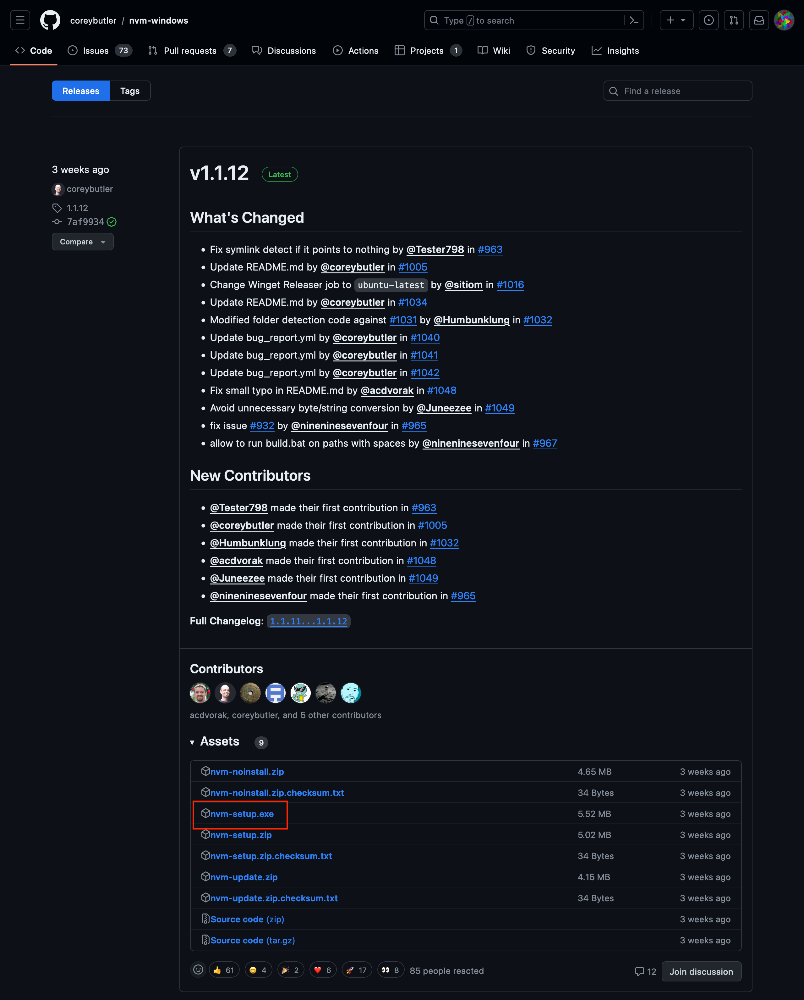
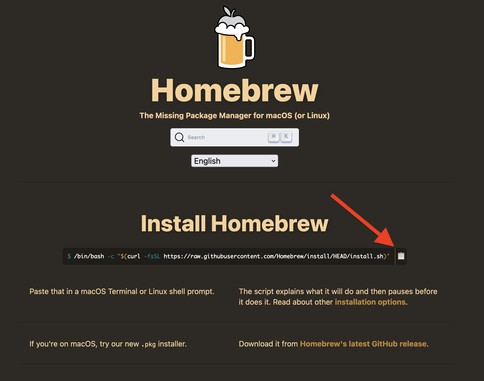
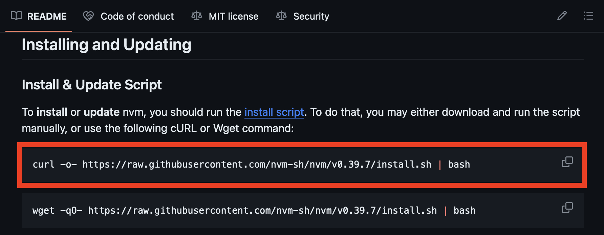

# Node 설치

## 목차

- [Node 설치](#node-설치)
  - [목차](#목차)
  - [nvm 설치](#nvm-설치)
    - [윈도우](#윈도우)
    - [맥](#맥)
    - [리눅스](#리눅스)
    - [설치 확인](#설치-확인)
  - [Node 설치](#node-설치-1)

## nvm 설치

[nvm](https://www.github.com/nvm-sh/nvm)은 Node Version Manager의 약자이다.  
말 그대로 Node의 버전을 관리해주는 프로그램이다.  
그냥 Node를 설치해도 되지만, 버전이 달라 문제가 생기지 않도록 nvm을 설치해서 버전을 맞추고 사용하는 것을 추천한다.

### 윈도우

[nvm for Windows](https://github.com/coreybutler/nvm-windows/releases) 에서 최신 버전을 다운로드 받는다.  
가장 위에 있는 글에서 살짝 내려가면 `Assets`라는 탭이 보이고 그 밑에 `nvm-setup.exe`라는 파일이 있다.  
해당 파일을 클릭해서 다운 받아 실행하면 된다.  


### 맥

nvm 저장소에 있는 `curl` 명령어로 바로 설치해도 되지만, [Homebrew](https://brew.sh/) 를 사용해서 설치하는 것을 추천한다.  
추후 다른 프로그램을 설치하거나 업데이트할 때 편리하기 때문이다.

[Homebrew](https://brew.sh/) 사이트에 들어가면 설치 명령어가 나와있다.  
바로 오른쪽에 있는 복사 버튼을 눌러서 복사한 뒤 터미널에 붙여넣고 실행하면 Homebrew가 설치된다.  


Homebrew가 설치되었다면 터미널에 `brew install nvm` 을 입력해서 nvm을 설치한다.

### 리눅스

리눅스는 [nvm 저장소 README 의 Installing and Updating](https://github.com/nvm-sh/nvm#installing-and-updating) 에 있는 `curl` 명령어로 설치한 뒤, `source ~/.bashrc` 로 적용시키면 된다.  


### 설치 확인

`nvm -v` 를 입력해서 설치한 nvm의 버전이 나온다면 설치가 잘 완료된 것이다.

## Node 설치

nvm을 설치했다면 다음을 터미널에 입력해서 Node LTS 버전을 설치한다.

```bash
nvm install --lts
nvm use --lts
```

윈도우 사용자는 `--` 를 빼고 입력하면 된다.

```bash
nvm install lts
nvm use lts
```

LTS 란 Long Term Support의 약자로 장기적으로 지원하는 버전을 말한다.  
쉽게 말해 버그가 제일 적고 안정적이라는 뜻이다.

만약 필자와 버전을 맞추고 싶다면 `20.10.0` 버전을 설치하면 된다.

```bash
nvm install 20.10.0
nvm use 20.10.0
```

설치가 완료되었다면 `node -v` 를 입력해서 설치한 Node의 버전이 나온다면 설치가 잘 완료된 것이다.
