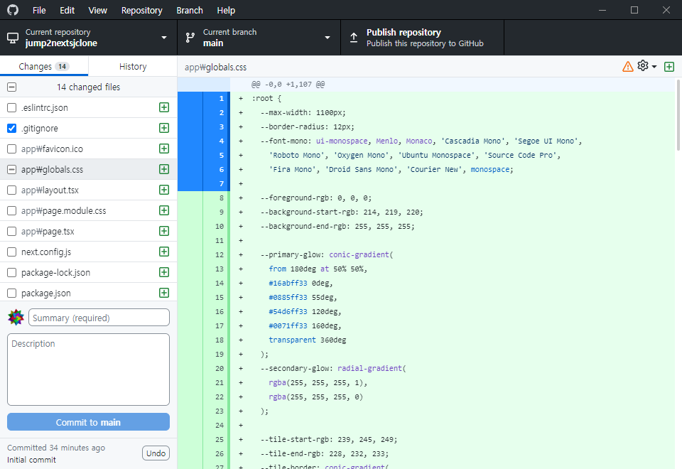

# git 저장소 만들기

## 목차

- [git 저장소 만들기](#git-저장소-만들기)
  - [목차](#목차)
  - [git 설치](#git-설치)
  - [GitHub Desktop 설치](#github-desktop-설치)
  - [저장소 만들기](#저장소-만들기)
  - [저장소 열기](#저장소-열기)
  - [저장소 push 하기](#저장소-push-하기)
  - [저장소 GitHub에 올리기](#저장소-github에-올리기)

## git 설치

git은 [공식 홈페이지](https://git-scm.com/downloads)에서 다운로드 받을 수 있다.  
맥 사용자는 [Homebrew](https://brew.sh/) 를 사용해서 설치할 수 있다.

```bash
brew install git
```

리눅스 사용자는 각자의 패키지 매니저를 사용해도 된다.

## GitHub Desktop 설치

[GitHub Desktop](https://desktop.github.com/) 은 GitHub에서 제공하는 git GUI 프로그램이다.  
맥 사용자는 [Homebrew](https://brew.sh/) 를 사용해서 설치할 수 있다.

```bash
brew install --cask github
```

git 명령어를 통채로 외워서 눈 감고도 git을 사용할 수 있을 정도로 git을 잘 다루는 사람이 아니라면 사용하는 것을 추천한다.  
~~리눅스라면... 뭐 어쩔 수 없다. 받아들이자.~~  
이후로도 git 관련 글은 GitHub Desktop을 사용해서 설명할 것이다.  
사이트에 접속하면 바로 설치버튼이 있으니 설치해서 사용하자.

## 저장소 만들기

만약 처음으로 GitHub Desktop을 실행했다면 로그인을 하라고 할 것이다.  
로그인 후 처음으로 보이는 화면에서 `Create a New Repository on your hard drive...` 버튼을 누르면 저장소를 만들 수 있다.  
이미 GitHub Desktop에 등록된 저장소가 있다면, 우측 상단의 `Current repository` 버튼을 누르고 `Add` 버튼을 누른다.  
그리고 `Create new repository...`를 누르면 저장소를 만들 수 있다.  
이름과 설명을 적고 `Create repository` 버튼을 누르면 저장소가 만들어진다.

> 맥 사용자는 기본 저장소 경로가 `/Users/사용자명/Documents/GitHub` 이다.
> 본인이 iCloud 를 사용하고 있다면 iCloud 드라이브에 저장소가 만들어지는데, 동기화 때문에 문제가 생길 수 있다.
> 그러니 iCloud 드라이브를 사용한다면 다른 경로에 저장소를 만들도록 하자.
> 필자는 `/Users/사용자명/GitHub` 에 저장소를 만들어서 사용한다.
> 윈도 사용자도 OneDrive 때문에 동기화 문제가 생길 수 있으니 동기화가 되지 않는 경로에 저장소를 만들도록 하자.

## 저장소 열기

저장소를 만들었다면 `Current repository` 버튼을 우클릭하고 `Open in Visual Studio Code`를 누르면 VSC에서 저장소가 열린다.  
혹은 ⌘ + ⇧ + A(맥) 혹은 Ctrl + Shift + A(윈도)를 눌러서도 열 수 있다.
다른 IDE를 사용한다면 본인이 사용하는 IDE에서 열어도 된다.

## 저장소 push 하기

파일을 수정하고 저장소에 push 하는 상황을 가정하자.  
commit 할 파일을 모두 저장하고 GitHub Desktop을 열면 다음과 같은 화면이 보일 것이다.

왼쪽의 목록은 수정된 파일 목록이고, 그 밑은 commit 메시지를 적을 수 있는 공간이다.  
오른쪽에는 수정된 파일의 수정된 내역을 볼 수 있다.  
파일 목록의 체크박스를 체크하고 해제하는 것만으로도 Staging Area에 파일을 올리고 내릴 수 있다.  
게다가 오른쪽의 파일 수정 내역의 줄 번호가 쓰인 부분을 클릭하면 그 줄만 Staging Area에 올리거나 내릴 수 있다.



위의 사진에서는 14개의 수정된 파일이 있고 그 중 `.gitignore` 파일 수정 내역 전체와 `app/global.css` 파일의 1~7번 줄의 수정 내역만 Staging Area에 올려져 있다.  
이 상태에서 commit 메시지를 적고 `Commit to main` 버튼을 누르면 `main` 브랜치로의 commit이 올라간다.

## 저장소 GitHub에 올리기

이후 상단의 `Publish repository` 버튼을 누르면 해당 저장소가 GitHub에 올리기 위한 설정 입력창이 뜬다.  
여기서 `Keep this code private` 를 체크하면 비공개 저장소로 만들 수 있다.  
하단의 `Publish repository` 버튼을 누르면 저장소가 GitHub에 올라간다.  
다시 원래 화면으로 돌아와서 상단의 `Publish repository` 버튼이 `Fetch origin` 버튼으로 바뀌었다면 성공적으로 저장소가 올라간 것이다.  
이 상태에서 `Repository` 탭의 `View on GitHub` 혹은 ⌘ + ⇧ + G(맥)/Ctrl + Shift + G(윈도) 를 누르면 GitHub 저장소로 이동할 수 있다.
이후 해당 버튼은 fetch/push/pull 을 위한 버튼으로 바뀐다.
