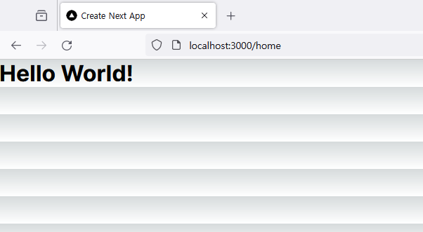

# 라우터

## 목차

- [라우터](#라우터)
  - [목차](#목차)
  - [라우팅이란](#라우팅이란)
  - [파일 기반 라우팅](#파일-기반-라우팅)

## 라우팅이란

라우팅routing은 웹 페이지 간의 이동 방법을 말한다.

## 파일 기반 라우팅

Next.js는 app(13.0.0 이전 버전에서는 pages) 디렉토리 내의 파일을 기반으로 라우팅을 한다.  
예를 들어 `app/home/page.tsx` 라는 파일을 만들었다면 `localhost:3000/home/` 로 접속할 수 있다는 뜻이다.  
`app/home/page.tsx` 파일을 다음과 같이 작성해보자.

```tsx
export default function Home() {
  return (
    <div>
      <h1>Hello World!</h1>
    </div>
  );
}
```

그리고 [http://localhost:3000/home/](http://localhost:3000/home/) 로 접속해보자.



`Hello World!` 라는 글자가 출력된 것을 확인할 수 있다.

여기서 `home` 폴더를 `hello` 로 바꾸고 [http://localhost:3000/home/](http://localhost:3000/home/) 로 접속하면 `404 | This page could not be found.` 라며 404 에러가 발생한다.  
대신 [http://localhost:3000/hello/](http://localhost:3000/hello/) 로 접속하면 우리가 만들었던 페이지를 다시 볼 수 있다.  
이렇게 직관적인 라우팅을 할 수 있다는 것이 Next.js 의 장점이다.
