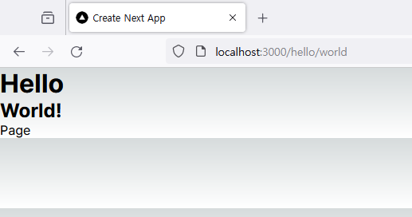

# page 와 layout

## 목차

- [page 와 layout](#page-와-layout)
  - [목차](#목차)
  - [page.tsx 와 layout.tsx](#pagetsx-와-layouttsx)
  - [page](#page)
  - [layout](#layout)

## page.tsx 와 layout.tsx

`npx create-next-app` 로 프로젝트를 생성하면 `app` 디렉토리에 `page.tsx` 와 `layout.tsx` 가 생성된다.  
이 중 `page.tsx` 는 페이지의 본문, `layout.tsx` 는 페이지의 레이아웃을 담당한다.  
`page.tsx` 와 `layout.tsx` 는 모두 `JSX.Element` 를 반환하는 함수를 default 로 내보내야 한다.

## page

`page.tsx` 는 가장 중요한 파일이다.  
해당 파일이 존재하지 않으면 페이지를 불러올 수 없다.

`page.tsx` 의 내용은 해당 페이지에서만 볼 수 있다.  
예를 들어 `app/hello/page.tsx` 의 내용은 `/hello` 페이지에서만 볼 수 있고 `/` 나 `/hello/world` 페이지에서는 볼 수 없다.  
이후 설명하겠지만 이와 대비되어 `app/hello/layout.tsx` 의 내용은 `/hello` 는 물론 `/hello/world` 등 하위 페이지에서도 볼 수 있다.

## layout

`layout.tsx` 는 페이지의 레이아웃을 담당한다.  
`app/layout.tsx` 는 필수지만 그외의 레이아웃은 선택사항이다.

위에서 설명했듯 `layout.tsx` 의 내용은 하위 경로의 페이지에서도 볼 수 있다.  
정확히 말하면 `layout.tsx` 은 하위 경로의 `layout.tsx` 과 중첩된다.  
예를 들어서 다음과 같은 파일을 작성해보자.

```tsx
// app/hello/layout.tsx
export default function HelloLayout({ children }: { children: JSX.Element }) {
  return (
    <div>
      <h1>Hello</h1>
      {children}
    </div>
  );
}
```

```tsx
// app/hello/world/layout.tsx
export default function WorldLayout({ children }: { children: JSX.Element }) {
  return (
    <div>
      <h2>World!</h2>
      {children}
    </div>
  );
}
```

```tsx
// app/hello/world/page.tsx
export default function WorldPage() {
  return (
    <div>
      <p>Page</p>
    </div>
  );
}
```

```tsx
// app/hello/page.tsx
export default function HelloPage() {
  return (
    <div>
      <p>Bye</p>
    </div>
  );
}
```

그리고 [http://localhost:3000/hello/world/](http://localhost:3000/hello/world/) 로 접속해보자.



`app/hello/layout.tsx`와 `app/hello/world/layout.tsx` 의 내용이 모두 출력됐지만 `app/hello/page.tsx` 의 내용은 출력되지 않았다.

그리고 위에서 보다시피 `layout.tsx` 은 props 으로 `children: JSX.Element` 를 받아야한다.  
`children` 은 페이지와 하위 레이아웃을 담고 있기 때문에 해당 `children` 은 반환값에도 포함시켜야 페이지가 정상적으로 출력된다.
