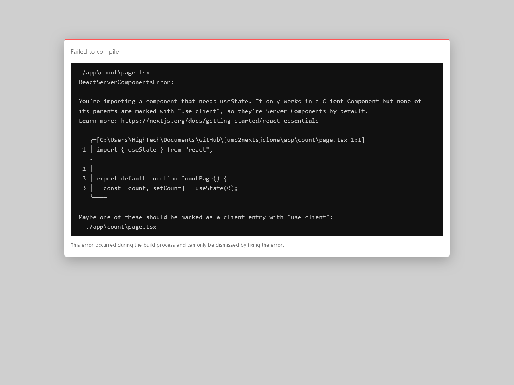

# Client Components

## 목차

- [Client Components](#client-components)
  - [목차](#목차)
  - [SSR](#ssr)
  - ["use client"](#use-client)
  - [예시](#예시)
    - [해결](#해결)

## SSR

이전에 말했다시피 Next.js는 기본적으로 SSR을 위한 프레임워크이다.  
그렇기 때문에 13 버전부터 Next.js는 별다른 설정이 없다면 모든 컴포넌트를 서버 컴포넌트로 처리한다.
하지만 분명 브라우저에서 동작해야하는 경우도 있다.  
이를 위해 해당 컴포넌트가 클라이언트 컴포넌트임을 명시해야한다.

## "use client"

클라이언트 컴포넌트로 명시하는 방법은 두 가지가 있다.  
파일 맨 위에 `"use client"` 라고 명시하거나, 함수의 맨 앞에 `"use client"` 라고 명시하면 된다.  
React 자체가 CSR 을 위한 라이브러리다 보니 React 관련 기능은 모두 클라이언트 컴포넌트로 정의해야한다.

## 예시

다음과 같은 코드를 작성해보자.

```tsx
// app/count/page.tsx
import { useState } from "react";

export default function CountPage() {
  const [count, setCount] = useState(0);

  return (
    <div>
      <p>{count}</p>
      <button onClick={() => setCount((prev) => prev + 1)}>+</button>
      <button onClick={() => setCount((prev) => prev - 1)}>-</button>
    </div>
  );
}
```

React 를 이용한 간단한 카운터다.  
하지만 [http://localhost:3000/count/](http://localhost:3000/count/) 로 접속하면 무시무시한 경고창이 뜬다.



### 해결

하지만 잘 읽어보면 생각보다 친절한 경고문임을 알 수 있다.

> You're importing a component that needs useState.
> It only works in a Client Component but none of its parents are marked with "use client", so they're Server Components by default.
> 당신은 useState 를 필요로 하는 컴포넌트를 불러왔습니다.
> 이 컴포넌트는 클라이언트 컴포넌트에서만 동작하지만 부모 컴포넌트들이 "use client" 로 표시되지 않았기 때문에 기본적으로 서버 컴포넌트입니다.

따라서 `CountPage` 의 맨 위에 "use client" 를 추가해 클라이언트 컴포넌트임을 명시해보자.

```tsx
// app/count/page.tsx
"use client";

import { useState } from "react";
...
```

그리고 [http://localhost:3000/count/](http://localhost:3000/count/) 로 접속해보면 카운터가 잘 동작하는 것을 확인할 수 있다.
