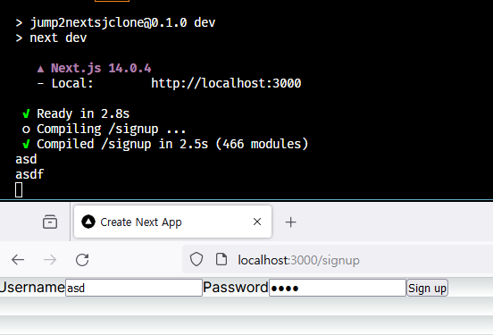

# Server Action

## 목차

- [Server Action](#server-action)
  - [목차](#목차)
  - [Server Action이란](#server-action이란)
  - ["use server"](#use-server)
  - [async](#async)
  - [예시](#예시)
    - [`form action`](#form-action)

## Server Action이란

Next.js 는 기본적으로 FE 프레임워크이다.  
하지만 13 버전에 실험적으로 Server Action 이라는 BE 기능이 추가됐고, 14버전부터는 정식으로 지원한다.

## "use server"

어떤 함수가 서버 액션으로 사용하기 위해서는 해당 함수가 서버 액션임을 명시해야한다.  
이를 위해서는 파일이나 함수의 맨 앞에 `"use server"` 를 추가하면 된다.

## async

그리고 서버 액션은 비동기 함수여야 한다.  
귀찮은 것 같지만 당연한 이야기이다.  
사용자의 입력을 서버에서 기다려야 하기 때문이다.  
그리고 어차피 비동기 처리는 Next.js 가 알아서 해주기 때문에, `async` 만 잘 붙여주면 된다.

## 예시

### `form action`

대체로 `form` 과 함께 사용하는 것이 일반적이다.

```ts
// app/signup/page.tsx
export default function SignupPage() {
  async function signup(form: FormData) {
    "use server";
    console.log(form.get("username"));
    console.log(form.get("password"));
  }
  return (
    <form action={signup}>
      <label>
        Username
        <input name="username" />
      </label>
      <label>
        Password
        <input name="password" type="password" />
      </label>
      <button type="submit">Sign up</button>
    </form>
  );
}
```



[http://localhost:3000/signup](http://localhost:3000/signup) 에서 `form` 을 제출하면, 서버의 콘솔에 해당 값들이 찍히는 것으로 서버에서 실행이 되고 있다는 것을 확인할 수 있다.

만약 해당 액션의 결과값을 다시 클라이언트에게 보내고 싶다면 `useFormState` 훅을 사용하면 된다.

<details>
  <summary><code>useFormState</code> 예시</summary>

```ts
// app/signup/actions.ts
"use server";

export interface State {
  username: string;
  password: string;
  prev?: {
    username: string;
    password: string;
  };
}

export async function signup(prevState: State, form: FormData): Promise<State> {
  const username = form.get("username") as string;
  const password = form.get("password") as string;
  delete prevState.prev;
  const prev = prevState;

  return {
    username,
    password,
    prev,
  };
}
```

```tsx
// app/signup/page.tsx
"use client";

import { useFormState } from "react-dom";
import { State, signup } from "./actions";

const initialState: State = {
  username: "",
  password: "",
};

export default function SignupPage() {
  const [state, formAction] = useFormState(signup, initialState);

  return (
    <form action={formAction}>
      <label>
        Username
        <input name="username" />
      </label>
      <label>
        Password
        <input name="password" type="password" />
      </label>
      <p>{JSON.stringify(state)}</p>
      <button type="submit">Sign up</button>
    </form>
  );
}
```

</details>
